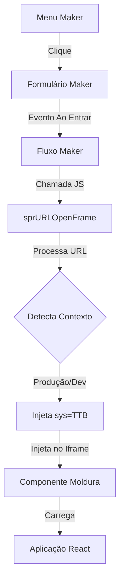

# 📑 Integração Maker ↔ React (Seprocom)

Este documento detalha o fluxo de renderização e a interação entre o motor Maker (WebRun) e os micro-frontends em React.

---

## 🏗️ Arquitetura de Contextos (Sibling WARs)

No ambiente Seprocom, os sistemas operam como aplicações irmãs (contextos separados) no Tomcat:

- **`/webrunstudio` ou `/sptabel`**: Motor Maker (Backend e Engine de telas).
- **`/gerencial`**: Central de recursos estáticos e Dashboard React (onde mora o script de integração).
- **`/notas`**: Backend API e aplicação React específica de Notas.

---

## 🛠️ O Script "Ponte": `sprGraficoEstoque.js`

Este arquivo é o núcleo da integração e reside em `/gerencial/html/assets/sprGraficoEstoque.js`. Ele desempenha duas funções principais:

### 1. Injeção do Dashboard (Sidebar)
O script localiza dinamicamente o menu lateral do Maker e injeta cards de informação.
- **Resiliência de API**: Como o sistema pode rodar sob diferentes nomes (`notas`, `sptabel`), o script tenta múltiplos endpoints para buscar dados de estoque e certificado até encontrar o ativo.

### 2. Navegação Bridge (`sprURLOpenFrame`)
Define a função global que o Maker chama para renderizar o React dentro de suas molduras.

---

## 🚀 Fluxo de Renderização Passo a Passo

### 1. Ação no Maker
O usuário clica em um menu (ex: "Selos Utilizados"). O formulário Maker correspondente é carregado. No evento **Ao Entrar** deste formulário, existe um fluxo Maker que invoca o JavaScript.

### 2. Chamada da Função
O fluxo executa:
```javascript
sprURLOpenFrame(form, "Moldura", "/gerencial/frontend/index.html#/selos");
```

### 3. Processamento de URL (Lógica Pro-Max)
A função `sprURLOpenFrame` realiza:
- **Detecção de Contexto**: Identifica se está rodando no Webrun Studio ou Webrun 5 (independente do nome do WAR).
- **Parâmetros**: Injeta automaticamente `sys=TTB` e `database` na URL para garantir que o React saiba qual sistema carregar.
- **Segurança de WAR**: Garante que caminhos para o projeto `/notas` não sejam prefixados com o contexto do motor Maker (ex: evita erro 404 de `/sptabel/notas/...`).

### 4. Localização e Injeção
O script localiza o componente `Moldura` no DOM do Maker e define o `src` do iframe.

### 5. Redimensionamento Dinâmico
Utiliza um `ResizeObserver` para monitorar o container pai da Moldura. Isso garante que o React se ajuste automaticamente à altura do formulário Maker, mesmo que o usuário redimensione a janela ou o template do Maker mude.

---

## 📊 Diagrama de Fluxo



---

## 🔍 Logs de Diagnóstico (Console F12)

| Log | Significado |
| :--- | :--- |
| `🚀 [sprURLOpenFrame] Iniciando...` | A ponte foi chamada com sucesso pelo fluxo Maker. |
| `💡 [sprURLOpenFrame] Detectado motor Maker...` | O script identificou corretamente que está dentro de um ambiente WebRun. |
| `⚠️ Componente não encontrado` | O nome informado no fluxo ("Moldura") não existe no formulário atual. |

---

> [!IMPORTANT]
> **Nota de Cache**: Sempre que o arquivo `sprGraficoEstoque.js` for alterado, é necessário realizar um **Ctrl+F5** no navegador para forçar a atualização, pois o Webrun tende a manter scripts em cache agressivo.
