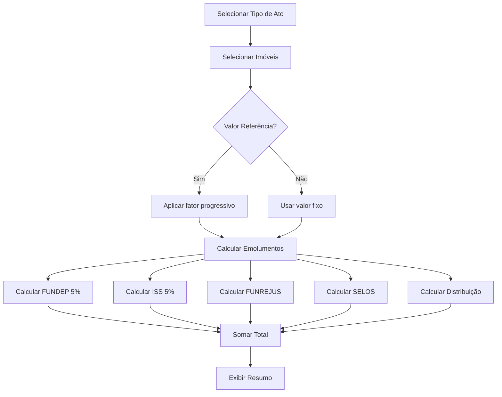

# Plano Arquitetural - Sistema de Cálculo de Custas Cartoriais

**Data:** 2026-02-01
**Projeto:** Protesto - Sistema de Custas Tabelionato de Notas
**Stack:** Java/Spring Boot + React + MariaDB

---

## 1. Visão Geral

Sistema para cálculo automático de emolumentos cartoriais conforme Código de Normas da Corregedoria do Paraná, integrado ao projeto Protesto existente.

### Objetivos Principais:
- CRUD para tipos de atos do tabelionato de notas
- Seleção dinâmica de imóveis por ato
- Cálculo automático de custas (emolumentos + encargos)
- Geração de detalhamento para escrituras

---

## 2. Estrutura do Banco de Dados

### Tabelas Existentes:
| Tabela | Descrição | Campos |
|--------|-----------|--------|
| `ser_custas` | Custas e serviços (50 registros) | CODIGO_CUS, TIPOATO_CUS, DESCR_CUS, VALOR_CUS, ALIQ_CUS, etc. |
| `ato` | Atos lavrados | PROTOC_LIVRO_ATO, ATO_ATO, VLR_ATO, FRJ_ATO, etc. |
| `imoveis` | Cadastro de imóveis | ID_IMO, MATRICULA_IMO, VALORITBI_IMO, DESCRICAO_IMO, etc. |
| `not_1` | Partes das escrituras | ID_NOT1, NOME_NOT1, QUALIF_NOT1, LIVRO_ATO, etc. |

### Tabela Nova - `partimoveis`:
```sql
CREATE TABLE partimoveis (
    ID_PARTIMOVEI INT UNSIGNED NOT NULL AUTO_INCREMENT PRIMARY KEY,
    CODPROT_PARTIMOVEI INT UNSIGNED NOT NULL COMMENT 'Referência ao PROTOC_LIVRO_ATO',
    ID_IMO INT UNSIGNED NOT NULL COMMENT 'Referência ao imóvel',
    TIPO_PARTICIPACAO CHAR(1) DEFAULT 'T' COMMENT 'T=Todos, P=Parcial',
    QUOTA_PARTICIPACAO DECIMAL(5,2) COMMENT 'Percentual de participação',
    VALOR_PARTICIPACAO DECIMAL(12,2) COMMENT 'Valor monetário da participação',
    DT_CADASTRO DATETIME DEFAULT CURRENT_TIMESTAMP,
    FOREIGN KEY (CODPROT_PARTIMOVEI) REFERENCES ato(PROTOC_LIVRO_ATO),
    FOREIGN KEY (ID_IMO) REFERENCES imoveis(ID_IMO),
    INDEX idx_codprot (CODPROT_PARTIMOVEI),
    INDEX idx_imo (ID_IMO)
) ENGINE=InnoDB DEFAULT CHARSET=utf8 COLLATE=utf8_general_ci;
```

---

## 3. Regras de Cálculo de Custas (CNCP Paraná)

### Tipos de Atos Suportados:

| Código | Descrição | Módulo | Valor Base (R$) | VRC Máximo |
|--------|-----------|--------|-----------------|------------|
| 401 | Autenticação | R | 5,54 | 20,00 |
| 402 | Reconhecimento (sem valor) | R | 6,01 | 21,73 |
| 403 | Reconhecimento (com valor) | R | 12,07 | 43,60 |
| 404 | Sinal Público | R | 12,07 | 43,60 |
| 408 | Escrita Divórcio Amigável | N | 277,00 | 1.000,00 |
| 409 | Escrita | N | 174,51 | 630,00 |
| 411 | Divórcio | N | 174,51 | 630,00 |
| 413 | Inventário | N | 174,51 | 630,00 |
| 416 | Constituição Condomínio | N | 277,00 | 1.000,00 |
| 417 | Unidade Divórcio Amigável | N | 11,08 | 40,00 |
| 418 | Pública Forma | N | 12,74 | 46,00 |
| 419 | Ata Notarial Interna | N | 174,51 | 630,00 |
| 420 | Ata Notarial c/Diligência | N | 349,02 | 1.260,00 |
| 422 | Procuração | N | 106,54 | 384,62 |
| 423 | Procuração em Causa Própria | N | 174,51 | 630,00 |
| 424 | Procuração Acresce Partes | N | 2,77 | 10,00 |
| 425 | Testamento | N | 554,00 | 2.000,00 |
| 426 | Testamento Cerrado | N | 83,10 | 300,00 |
| 427 | Revogação Testamento | N | 277,00 | 1.000,00 |
| 428 | Pública Forma | N | 12,74 | 46,00 |
| 429 | Pública Forma Acresce Folhas | N | 8,31 | 30,00 |
| 431 | Certidão de Procuração | N | 11,08 | 40,00 |
| 432 | Certidão de Escritura | N | 8,31 | 30,00 |
| 436 | Buscas 10 Anos | N | 1,66 | 6,00 |
| 437 | Apostilamento | R | 53,46 | 193,00 |
| 443 | Vaga de Garagem | N | 174,51 | 630,00 |
| 444 | Ata Notarial Usucapião | N | 174,51 | 630,00 |
| 449 | Reconhecimento Eletrônico | R | 12,07 | 43,60 |

### Encargos Obrigatórios:

| Código | Descrição | Alíquota | Observação |
|--------|-----------|----------|------------|
| 901 | FUNDEP | 5% | Sobre emolumentos |
| 902 | Distribuição ATA | R$ 8,15 | Valor fixo |
| 903 | SELO TN1 | R$ 1,00 | Valor fixo |
| 904 | ISS | 5% | Sobre emolumentos |
| 905 | Distribuição | R$ 12,72 | Valor fixo |
| 906 | SELO AH | R$ 1,00 | Valor fixo |
| 907 | FUNREJUS | 0,25% + 0,002% | Sobre base de cálculo |
| 908 | SELO TN2 | R$ 8,00 (2x) | Valor fixo |
| 909 | SELO TN3 | R$ 0,25 | Valor fixo |

### Fórmula de Cálculo:

```
Emolumentos = VALOR_CUS × fator_progressivo (se QTDEVRC_CUS > 0)

FUNDEP = Emolumentos × 0,05
ISS = Emolumentos × 0,05
FUNREJUS = (BaseCalculo × 0,0025) + (BaseCalculo × 0,00002)
SELOS = Σ (VALOR_CUS para CODIGO_CUS em 903, 906, 908, 909)
Total = Emolumentos + FUNDEP + ISS + FUNREJUS + SELOS + Distribuição
```

---

## 4. Arquitetura do Sistema

### Backend (Java/Spring Boot)

```
src/main/java/com/monitor/funarpen/
├── web/
│   └── CustasController.java              # Endpoints REST
├── service/
│   ├── CalculoCustasService.java          # Lógica de cálculo
│   ├── SerCustasService.java              # CRUD custas
│   └── AtoService.java                    # CRUD atos
├── dao/
│   ├── SerCustasDAO.java
│   ├── AtoDAO.java
│   ├── ImoveisDAO.java
│   └── PartimoveisDAO.java
├── dto/
│   ├── CalculoCustasRequest.java
│   ├── CalculoCustasResponse.java
│   ├── AtoDTO.java
│   ├── ImovelDTO.java
│   └── PartimoveisDTO.java
└── model/
    ├── SerCustas.java
    ├── Ato.java
    ├── Imoveis.java
    └── Partimoveis.java
```

### Endpoints REST:

```
GET  /maker/api/funarpen/custas/tipos-atos          # Lista tipos de atos
GET  /maker/api/funarpen/custas/tipos-atos/{id}     # Detalhe tipo de ato
GET  /maker/api/funarpen/imoveis?search=...         # Busca imóveis
GET  /maker/api/funarpen/imoveis/{id}               # Detalhe imóvel
POST /maker/api/funarpen/calculo/custas             # Calcula custas
POST /maker/api/funarpen/atos                       # Cria novo ato
PUT  /maker/api/funarpen/atos/{id}                  # Atualiza ato
DELETE /maker/api/funarpen/atos/{id}                # Remove ato
```

### Frontend (React)

```
frontend/custas-notas/
├── public/
│   └── index.html
├── src/
│   ├── index.jsx
│   ├── App.jsx
│   ├── components/
│   │   ├── TipoAtoSelect.jsx        # Dropdown de tipos de atos
│   │   ├── ImoveisTable.jsx         # Tabela de seleção de imóveis
│   │   ├── CustasSummary.jsx        # Resumo de custas
│   │   └── CalculoDetalhado.jsx     # Detalhamento do cálculo
│   ├── services/
│   │   └── api.js                   # Wrapper API REST
│   ├── hooks/
│   │   └── useCalculoCustas.js      # Hook de cálculo
│   ├── utils/
│   │   └── calculoCustas.js         # Funções de cálculo
│   └── styles/
│       └── Custas.css
├── package.json
└── README.md
```

---

## 5. Fluxo de Cálculo



---

## 6. Interface do Usuário

### Tela Principal - Componentes:

1. **TipoAtoSelect** - Dropdown com busca para selecionar tipo de ato
   - Filtros por módulo (N=Notas, R=Registro, O=Outros)
   - Pesquisa por descrição ou código
   - Exibição de valor base e VRC máximo

2. **ImoveisTable** - Tabela de seleção múltipla de imóveis
   - Busca por matrícula, registro ou descrição
   - Exibição de valor ITBI
   - Checkbox para seleção

3. **CalculoDetalhado** - Painel com breakdown das custas
   - Emolumentos
   - FUNDEP
   - ISS
   - FUNREJUS
   - SELOS
   - Distribuição
   - TOTAL

4. **CustosSummary** - Resumo final
   - Total geral
   - Botão para salvar/imprimir

---

## 7. Regras de Negócio

### Para Cálculo de Emolumentos:
1. Se `QTDEVRC_CUS > 0` e `VALOR_CUS > QTDEVRC_CUS`, calcular fator
2. Senão usar `VALOR_CUS` diretamente
3. Arredondar para 2 casas decimais

### Para Encargos:
1. FUNDEP e ISS: sempre calculados sobre emolumentos
2. FUNREjus: usar base de cálculo informada ou emolumentos
3. SELOS: somar conforme tipo de ato

### Para Imóveis:
1. Múltiplos imóveis permitem divisão proporcional
2. Valor ITBI usado como base para cálculo
3. Imóveis isentos: considerar valor declarado

---

## 8. Script de Banco de Dados

```sql
-- Criar tabela partimoveis
CREATE TABLE partimoveis (
    ID_PARTIMOVEI INT UNSIGNED NOT NULL AUTO_INCREMENT PRIMARY KEY,
    CODPROT_PARTIMOVEI INT UNSIGNED NOT NULL,
    ID_IMO INT UNSIGNED NOT NULL,
    TIPO_PARTICIPACAO CHAR(1) DEFAULT 'T',
    QUOTA_PARTICIPACAO DECIMAL(5,2),
    VALOR_PARTICIPACAO DECIMAL(12,2),
    DT_CADASTRO DATETIME DEFAULT CURRENT_TIMESTAMP,
    FOREIGN KEY (CODPROT_PARTIMOVEI) REFERENCES ato(PROTOC_LIVRO_ATO),
    FOREIGN KEY (ID_IMO) REFERENCES imoveis(ID_IMO),
    INDEX idx_codprot (CODPROT_PARTIMOVEI),
    INDEX idx_imo (ID_IMO)
) ENGINE=InnoDB DEFAULT CHARSET=utf8;

-- Grant de permissões (se necessário)
-- GRANT SELECT, INSERT, UPDATE, DELETE ON sptabel.partimoveis TO 'user'@'localhost';
```

---

## 9. Plano de Implementação

### Sprint 1: Backend
- [ ] Criar script SQL `partimoveis`
- [ ] Implementar Models (SerCustas, Ato, Imoveis, Partimoveis)
- [ ] Implementar DAOs
- [ ] Implementar Services (CalculoCustasService)
- [ ] Implementar Controller REST

### Sprint 2: Frontend
- [ ] Criar estrutura React
- [ ] Implementar components
- [ ] Integrar com API
- [ ] Implementar cálculos no frontend
- [ ] Testes unitários

### Sprint 3: Integração
- [ ] Deploy em ambiente dev
- [ ] Testes de integração
- [ ] Documentação
- [ ] Deploy em produção

---

## 10. Referências

- Código de Normas da Corregedoria do Paraná (CNCP)
- Tabela de Emolumentos 2024 - Tribunal de Justiça do Paraná
- Lei Estadual 13.445/2002 (Regulamento do Funarpen)
